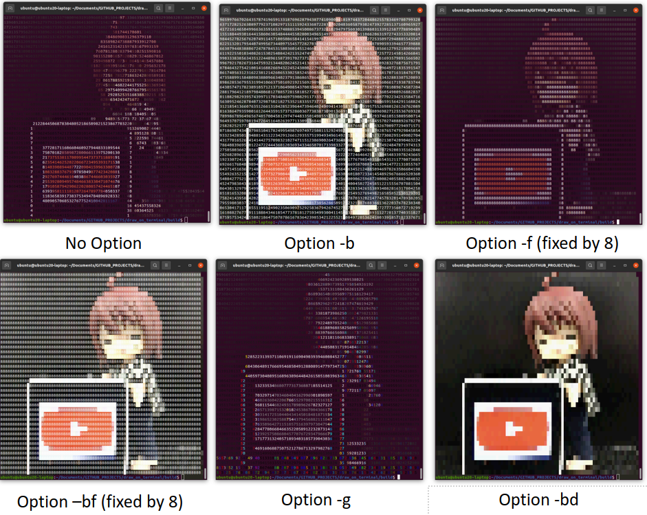

# Draw on terminal

#### [English]

# My girlfriend doesn't come out of my "Terminal"!


## Description

- This program draws images or videos on the terminal.

## Requirement

- Ubuntu18.04 LTS Desktop
- Build:CMake2.8, OpenCV3.2 

## Installation & Usage

#### Installation


```sh
git clone https://github.com/Ar-Ray-code/draw_on_terminal.git
cd draw_on_terminal
mkdir build
cd build
cmake ..
make
```

#### Usage

`./draw_on_terminal <options> <your image or video file>`

e.g. if you have video.mp4, Try to execute `./draw_on_terminal video.mp4`

- The larger the image, the slower the drawing of the terminal. It takes 5 to 10 seconds for a 4K display.

- The size of the output image depends on the width of the terminal.


## Options

- --help or -h                      : View help
- --background or -b        : Background is colored.
- --number or -n               : Number is colored.
- --fixed_value or -f           : Output values are fixed at 8.
- --random_value or -r     : Output values are random number.
- --disable_number or -d : Disable output values.
- --gray_enable or -g         : The number is output in grayscale.(In development)



## License

MIT : https://github.com/Ar-Ray-code/draw_on_terminal/blob/main/LICENSE


## About writer

- Ar-Ray : Japanese student.
- Brog(Japanese) : https://ar-ray.hatenablog.com/
- Twitter : https://twitter.com/Ray255Ar